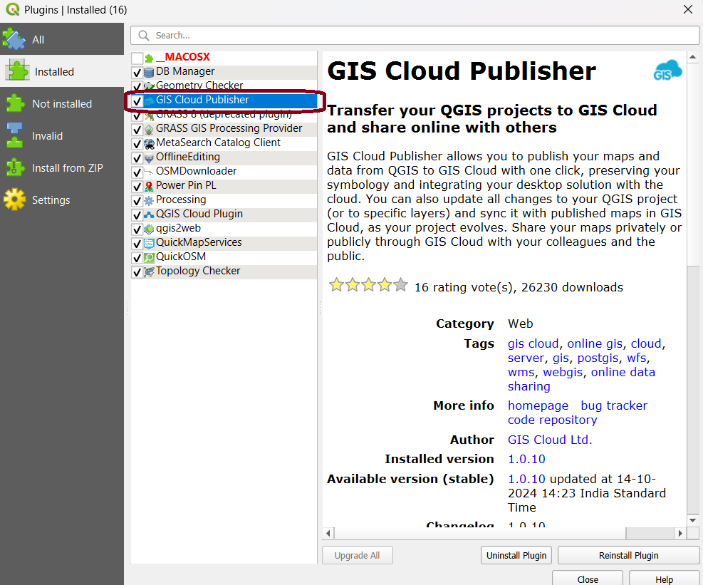
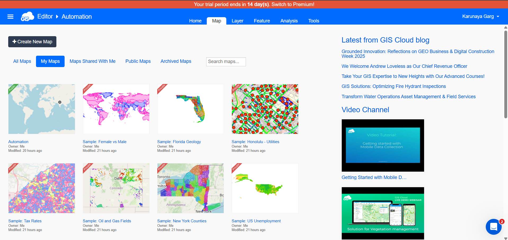
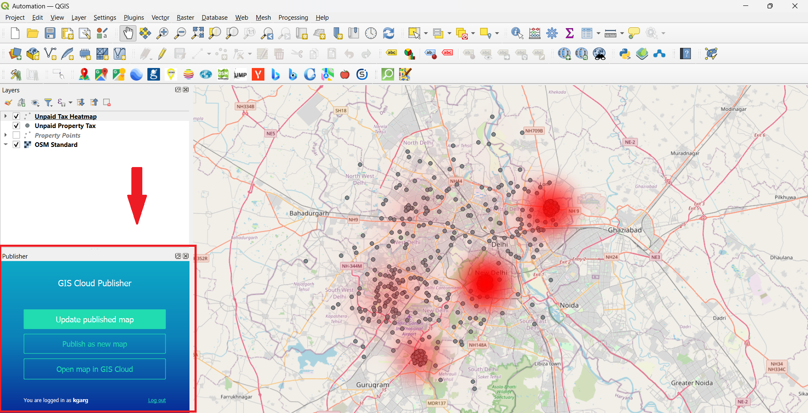
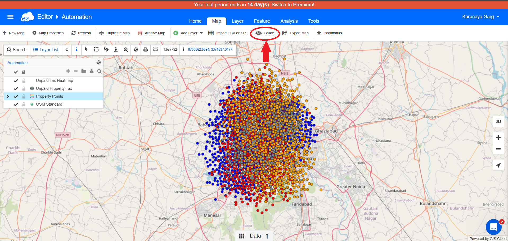
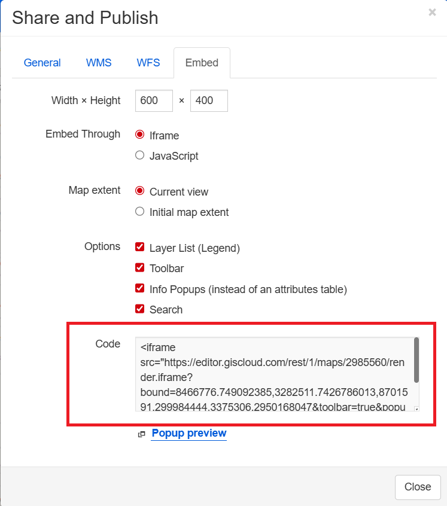

# 🌐 Publishing Maps with GIS Cloud Publisher in QGIS

This guide shows how to publish your QGIS map online using the **GIS Cloud Publisher** plugin and embed the interactive map in a website.

---

## 1. Install the GIS Cloud Publisher Plugin

- In QGIS, go to the **Plugins** menu and select **Manage and Install Plugins**.
- Search for **“GIS Cloud Publisher”**.
- Click **Install**. The plugin icon will now appear in your QGIS toolbar.



---

## 2. Create a GIS Cloud Account & Open Map Editor

- Go to the [GIS Cloud website](https://www.giscloud.com/) and sign up for a free account.
- After logging in, access the **Map Editor** dashboard.



---

## 3. Upload Your Map from QGIS

- Click the **GIS Cloud Publisher** icon in QGIS to open the plugin window.
- Log in with your GIS Cloud credentials if prompted.
- Select the QGIS project or layers you want to upload.
- Click **Upload Map**. Wait for the confirmation that your map has been published.



---

## 4. Open & Edit the Map in GIS Cloud

- Navigate to the GIS Cloud website and open the **Map Editor**.
- Find your newly uploaded map in **Your Maps**.
- Open it to view and edit settings or layer details as needed.

---

## 5. Share and Embed the Map

- In the Map Editor, click on **Share**.
- Go to the **Embed** section.
- Copy the generated iFrame code.




---

## 6. Integrate the Map into Any Website

- Paste the copied iFrame code into your website’s HTML where you want the map displayed.
- Adjust `width` and `height` attributes as needed.
---
**Example iFrame Embed:**

``` <iframe src="https://editor.giscloud.com/rest/1/maps/2985560/render.iframe?bound=-60112525.028367594,-23794541.157062177,60112525.028367594,23716269.640098155&toolbar=true&popups=true&layerlist=true&search=true" width="600" height="400" frameborder="0"></iframe> ```

---

## Check out the [Demo Integration](integration_1.html) from here.